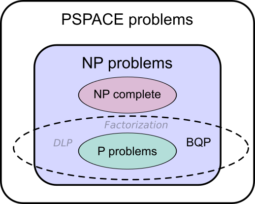

---
title: Cryptography – Exam Questions
author: Tim Herbstrith
date: 2020
bibliography: references.bib
linkReferences: true
link-citations: true
...

All quotes are from @Arzhantseva2019.

# Cryptography principles / Basic model for secrecy / Cryptosystem for secrecy

> Cryptography principles definitions, (non) examples. Basic cryptography
> concepts (primitive, protocol, cover time, etc.). Basic model for secrecy:
> (non)-examples. Cryptosystem for secrecy: definition, examples. Symmetric
> versus asymmetric cryptosystems.

## Cryptography principles

*  Confidentiality / secrecy:
    -  limit access to information
*  Data Integrity
    -  data was not altered (intentionally or accidentally)
    -  detection of alteration (not prevention)
*  Data origin authentication / message authentication
    -  confirms the origin of data with no temporal aspect to the **receiver**
    -  not necessarily an immediate source / not when
*  Entity authentication
    -  a given entity is involved and currently active
    -  e.g. log in at web service
*  Non-Repudiation
    -  a source of data cannot deny to a **third party** being at the origin

Data origin authentication $⇒$ Data integrity

Non-Repudiation $⇒$ Data origin authentication

Data origin authentication $≠$ Entity authentication

Secrecy $\nRightarrow$ Data origin authentication

## Different cryptographic concepts

*  Cryptography = **toolkit**
*  Cryptographic **primitive** = a basic tool in this toolkit
   -  Examples:
      Encryption, hash function, MAC (message authentication code),
      digital signature, etc.
*  Cryptographic **algorithm** = Cipher = a specification of a primitive
*  Cryptographic **protocol** = a way to choose primitives and use them
   for a security goal
*  Crypto**system** = implementation of primitives and the infrastructure

## Basic model of a cryptosystem

![Basic model of a cryptosystem [@Martin2012]](./imgs/basic_model_for_secrecy.png){#fig:basic_model}

@Fig:basic_model depicts a sender who wishes to transfer some data to a receiver
in such a way that any party intercepting the transmitted data cannot determine
the content. *The interceptor must not know the decryption key.*

Secrecy can be provided by (combination of):

1. Cryptography (via encryption)
2. Steganography (via information hiding)
3. Access control (via software or hardware)

## Definition of Cryptosystem

**Cryptosystem** is a $5$-tuple $(\mathcal{P, C, K, E, D})$ satisfying:

* $\mathcal{P}$ is a finite set of possible **plaintexts**;
* $\mathcal{C}$ is a finite set of possible **ciphertexts**;
* $\mathcal{K}$, the keyspace, is a finite set of possible **keys**;
* $\mathcal{E} = \lbrace{E_k : k ∈ \mathcal{K}}\rbrace$ consists of **encryption
  functions** $E_k : \mathcal{P → C}$;
* $\mathcal{D} = \lbrace{D_k : k ∈ \mathcal{K}}\rbrace$ consists of **decryption
  functions** $D_k : \mathcal{C → P}$;
* For all $e ∈ \mathcal{K}$ there exists $d ∈ \mathcal{K}$ such that for all
  plaintexts $p ∈ \mathcal{P}$ we have:
  $$D_d(E_e(p)) = p$$

The cryptosystem is

*  **symmetric** if $e = d$ and
*  **public-key** if $d$ cannot be derived from $e$ in a computationally
   feasible way

## Cover time

**Cover time** = the time for which a plaintext must be kept secret.

# Attacks on encryption algorithms

> Main attacks on encryption algorithms. Passive versus active attacks.
> Keys: length, size. Brute-force attack: assumptions, estimates on key lengths.

## Targets of attacks

*  A practical method of determining the **decryption key** is found.
*  A weakness in the encryption algorithm leads to a **plaintext**.

## Passive vs active attacks

*  The main type of **passive attack** is unauthorised access to data.
*  An **active attack** involves either data being changed in some way, or a
   process being conducted on the data.

## Key lengths and sizes

*  **Length** of the key = number of bites it takes to represent the key
*  **Size** of the keyspace = number of possible different decryption keys

## Assumptions

*  All keys from the keyspace are equally likely to be selected
*  The correct decryption key is identified as soon as it is tested

## Estimates on key length

If Size = $n = 2k$, then, on average, one needs $∼ 2k − 1$ attempts to find the
correct decryption key:

$$\mathbb{E}[X] = \sum_{i = 1}^n i \frac{1}{n} =
   \frac{n \; (n - 1)}{2} = \frac{2^k + 1}{2} ∼ 2^{k - 1}$$

# Examples of symmetric cryptosystems {#sec:symmetric-cs}

> Examples of symmetric cryptosystems: Caesar and Substitution ciphers. The
> letter frequency analysis. Monoalphabetic and polyalphabetic cyphers.
> Vigenère cipher. If the given key of a Vigenère Cipher has repeated letters,
> does it make it any easier to break?

## Caeser Cipher

Replace each alphabet by another alphabet which is ‘shifted’ by some fixed
number between 0 and 25. Key = ’secret shift number’. Length=1

Formally, we identify $\lbrace \mathtt{A, B, C, …, Z} \rbrace \cong ℤ / 26 ℤ$.
Then $\mathcal{P} = \lbrace{(a_0, …,a_n) \mid a_i ∈ ℤ / 26 ℤ, n ∈ ℕ}\rbrace$
and
$$\begin{aligned}
E_k(a_1, …, a_n) &= (a_0 + k, …, a_n + k)\\
D_k(c_1, …, c_n) &= (c_0 - k, …, c_n - k).
\end{aligned}
$$
(all operations are to be understood $\mod 26$.)

![The Caeser Cipher shifts all letters by a fixed constant [@CaeserCipher2020]](./imgs/caeser.png){#fig:caeser}

## Simple Substitution Cipher

Replace each alphabet by another alphabet which is its random permutation. Key =
a permutation of 26 letters. Length = 26

Formally, we identify $\lbrace \mathtt{A, B, C, …, Z} \rbrace \cong ℤ / 26 ℤ$.
Then $\mathcal{P} = \lbrace{(a_0, …,a_n) \mid a_i ∈ ℤ / 26 ℤ, n ∈ ℕ}\rbrace$
and
$$\begin{aligned}
E_k(a_1, …, a_n) &= (σ(a_0), …, σ(a_n))\\
D_k(c_1, …, c_n) &= (σ^{-1}(c_0), …, σ^{-1}(c_n)),
\end{aligned}$$
where $σ ∈ Sym(26)$ is the encryption/decryption key.

Caeser Cipher is special case of Simple Substitution Cipher, where $σ$ is a
cyclic permutation.

The total key space has size $26!$, which is greater than the number of stars in
the universe.

Since every letter is encrypted by a unique letter, SSC is an example of a
**monoalphabetic** cipher.

They are easily breakable by **letter frequency analysis**:

If the plaintext is known to be written in a specific language, we can compare
letter frequencies of the language with the letter frequencies of the cipher
text.

Thus, **large keyspace is necessary but not sufficient** for security!

![Comparing letter frequencies of known language with ciphertext [@FrequencyAnalysis2020]](./imgs/frequency-analysis.png){#fig:frequency-analysis}

## Vigenère Cipher

Generate a key by repeating a given key until it matches the length of the
plaintext. Replace each plaintext letter by another letter using a Caesar
Cipher, whose key is the number associated to the corresponding letter of the
generated key. Key = a string of letters.

Formally, we identify $\lbrace \mathtt{A, B, C, …, Z} \rbrace \cong ℤ / 26 ℤ$.
If $l$ is the length of the key, then
$\mathcal{P} = \lbrace{(a_0, …,a_n) \mid a_i ∈ ℤ / 26 ℤ, n ∈ ℕ}\rbrace$
and
$$\begin{aligned}
E_k(a_1, …, a_n) &= (a_1 + k_{0 \mod l}, …, a_n + k_{n \mod l})\\
D_k(c_1, …, c_n) &= (c_1 - k_{0 \mod l}, …, c_n - k_{n \mod l}).
\end{aligned}
$$
(all operations are to be understood $\mod 26$.)

Vigenère Cipher is an example of **polyalphabetic** ciphers (each given letter
can be encrypted into $l$ different letters).

The naive letter frequency analysis does not work, as the same letter is
encrypted by different letters depending on its position.

If the key length is known, the Vigenère Cipher can be broken, breaking a
sequence of Caesar Ciphers in strict rotation.

The key length can be guessed using simple analyses of the cipher text (Kasiski
test, index of coincidence).

# Computational complexity

> Computational complexity of basic mathematical operations and of the
> exhaustive key search attack. Complexity classes of algorithms.

## Turing Machines

### Deterministic Turing machines

$k$-tape Turing machine is a triple $M = (A,Q,τ)$ satisfying:

*  $A$ is a finite **alphabet** that the $k$ tapes contain:
   $A = \lbrace{\square, \vartriangleright, 0, 1}\rbrace$;
*  $Q$ is a finite set of **states** that includes $q_{start}, q_{halt} ∈ Q$;
*  $τ: Q × A^k → Q × A^{k−1} × \lbrace{L,S,R}\rbrace^k$ is the
   **transition function** of $M$.

*Tape* is function $ℕ → A$.

First tape is **input** tape (read-only), second to $k-1$-st tape are **work**
tapes, $k$-th tape is **output** tape.

$\square$ is the **blank** symbol, $\vartriangleright$ is the **start** symbol

$q_{start}, q_{halt}$ are the **start** and **halting** states

A **register** contains a current state

A **tape head** reads/write symbols, moves Left, Right or Stays

Explain these notions using @fig:turing.

![A Turing machine with 3 tapes [@Arora2009]](./imgs/turing.png){#fig:turing}

### Probabilistic Turing machine

A Turing machine that may choose at every step a move at random according to a
probability distribution.

Note that such a Turing machine is thus **non-deterministic**.

A probabilistic Turing machine $M$ computes a function
$f: \lbrace{0, 1}\rbrace^* → \lbrace{0, 1}\rbrace^*$ if
$$P[f(x) = M(x)] ≥ ⅔
$$

## Running time

$M$ computes $f: \lbrace{0, 1}\rbrace^* → \lbrace{0, 1}\rbrace^*$ in
$T(n)$-time, if for every input $x ∈ \lbrace{0, 1}\rbrace^*$, $M$ halts after at
most $T(|n|)$ steps with output $f(x)$.

### Running times of arithmetic operations

| Operation                                | Complexity |
| ---------------------------------------- | ---------- |
| Addition of two $n$-bit numbers          | $O(n)$     |
| Multiplication of two $n$-bit numbers    | $O(n^2)$   |
| Raising a number to an $n$-bit power     | $O(n^3)$   |
| Exhaustive key search for an $n$-bit key | $O(2^n)$   |

## Decidablity and Verifiability

### Decidablity

A language $L ⊂ \lbrace{0, 1}\rbrace^*$ is **decidable** if there exists a
deterministic Turing machine computing
$$χ_{L}(x) := \begin{cases}
1 & \text{if } x ∈ L \\
0 & \text{if } x \not\in L
\end{cases}.
$$

### Verifiability

A language $L ⊂ \lbrace{0, 1}\rbrace^*$ is **recursively enumerable** if there
exists a deterministic Turing machine computing a function
$$ν_{L}: \lbrace{0, 1}\rbrace^* \times \lbrace{0, 1}\rbrace^* →
\lbrace{0, 1}\rbrace,
$$
with the property that
$$x ∈ L \quad ⇔ \quad ∃ c ∈ \lbrace{0, 1}\rbrace^*: ν_{L}(x, c) = 1.$$
We call $c$ a **certificate** for $x$.

**Note:** Definiton in C2 is wrong!

## Complexity classes

A problem instance $x$ lies in the **complexity class**

*  **$P$** if $x$ is solvable by a polynomial **deterministic** algorithm.
*  **$BPP$** if $x$ is solvable by a polynomial **probabilistic** algorithm.
*  **$BQP$** if $x$ is solvable by a polynomial deterministic algorithm on
     a **quantum** computer.
*  **$NP$** if $x$ is **verifiable** by a polynomial deterministic algorithm.

{#fig:complexities}

It is conjectured that $P = BPP$ and Discrte Logarithm Problem as well as
Factorization do not lie in $NP ∩ BPP$.

# Three types of security

> Three types of security. Perfect secrecy: definition, examples, equivalent
> formulations (with proof). Perfect secrecy: Shannon’s Theorem (with proof).

## Types of security

*  **Computational security:** computational complexity is high.
*  **Provable security:** breaking the cryptosystem would solve a problem known
   to be hard.
*  **Unconditional security:** breaking is not possible even if computational
   resources are unlimited.

## Perfect secrecy

A cryptosystem has **perfect secrecy** if seeing the ciphertext gives not extra
information about the plaintext.

A cryptosystem with perfect secrecy is **unconditionally secure** against a
ciphertext only attack.

Let $(\mathcal{P, C, K, E, D})$ be a cryptosystem and probability distributions
are given on $\mathcal{P}$ and $\mathcal{K}$:

* $Pr[\mathbf{p} = p]$ denotes the probability that a plaintext $p ∈
  \mathcal{P}$ occurs,
* $Pr[\mathbf{k} = k]$ denotes the probability that a key $k ∈ \mathcal{K}$ is
  chosen.

Analogously, $Pr[\mathbf{c} = c]$ denotes the probability that a ciphertext
$c ∈ \mathcal{C}$ is transmitted.

### Assumptions

*  the key and the plaintext are independent random variables;
*  each key is used for only one encryption.

### Propability distribution on $\mathcal{C}$

By assumption we have for all $c ∈ \mathcal{C}$ that
$$Pr[\mathbf{c} = c] = \sum_{k \text{ with } c ∈ C(k)}
Pr[\mathbf[k] = k] Pr[\mathbf{p} = D_k{c}]
$$
where $C(k) := \lbrace{E_k(p) : p ∈ \mathcal{P}}\rbrace$. This yields
$$Pr[\mathbf{c} = c \mid \mathbf{p} = p] =
\sum_{k \text{ with } c = D_k(p)} Pr[\mathbf{k} = k]
$$
Bayes' theorem implies (if $Pr[\mathbf{c} = c] > 0$) that
$$Pr[\mathbf{p} = p \mid \mathbf{c} = c] =
\frac{Pr[\mathbf{p} = p] \; Pr[\mathbf{c} = c \mid \mathbf{p} = p]}
     {Pr[\mathbf{c} = c]}.
$$

### Definition

A cryptosystem has **perfect secrecy** if
$Pr[\mathbf{p} = p \mid \mathbf{c} = c] = Pr[\mathbf{p} = p]$ for all
$p ∈ \mathcal{P},c ∈ \mathcal{C}$.

### Equivalent formulations

TFAE:

1. $(\mathcal{P, C, K, E, D})$ has perfect secrecy;
2. random variables $\mathcal{p}$ and $\mathcal{c}$ are independent;
3. $Pr[\mathbf{c} = c \mid \mathbf{p} = p] = Pr[\mathbf{c} = c]$;
4. $∀ p_1, p_2 ∈ \mathcal{P}:
   Pr[\mathbf{c} = c \mid \mathbf{p}=p_1] =
   Pr[\mathbf{c} = c \mid \mathbf{p}=p_2]$

The distribution of $\mathcal{P}$ is irrelevant!

*Proof:* WLOG, we assume that $Pr[\mathbf{c} = c], Pr[\mathbf{p} = p] > 0$ for
all $c ∈ \mathcal{C}, p ∈ \mathcal{P}$. Otherwise, restrict $\mathcal{C}$ or
$\mathcal{P}$.

($1 ⇒ 2$):
$$Pr[\mathbf{p} = p ∩ \mathbf{c} = c] =
Pr[\mathbf{p} = p \mid \mathbf{c} = c] Pr[\mathbf{c} = c] =
Pr[\mathbf{p} = p] Pr[\mathbf{c} = c]$$

($2 ⇒ 3$):
$$Pr[\mathbf{c} = c \mid \mathbf{p} = p] =
\frac{Pr[\mathbf{p} = p ∩ \mathbf{c} = c]}{Pr[\mathbf{p} = p]} =
\frac{Pr[\mathbf{p} = p] Pr[\mathbf{c} = c]}{Pr[\mathbf{p} = p]} =
Pr[\mathbf{c} = c]
$$

($3 ⇒ 4$): $∀ c ∈ \mathcal{C}$ and $∀ p_1, p_2 ∈ \mathcal{P}$ we have
$$Pr[\mathbf{c} = c \mid \mathbf{p}=p_1] = Pr[\mathbf{c} = c] =
Pr[\mathbf{c} = c \mid \mathbf{p}=p_2].
$$

($4 ⇒ 1$): By Bayes' Theorem we have
$$\begin{aligned}
\frac{Pr[\mathbf{c} = c] Pr[\mathbf{p_1} = p \mid \mathbf{c} = c]}
        {Pr[\mathbf{p} = p_1]} &=
        Pr[\mathbf{c} = c \mid \mathbf{p}=p_1] =\\
 &= Pr[\mathbf{c} = c \mid \mathbf{p}=p_2] = \\
 &= \frac{Pr[\mathbf{c} = c] Pr[\mathbf{p_2} = p \mid \mathbf{c} = c]}
         {Pr[\mathbf{p} = p_2]}
\end{aligned}
$$
Thus, there exists a constant $λ ∈ ℝ$ such that
$$Pr[\mathbf{p} = p \mid \mathbf{c} = c] = λ Pr[\mathbf{p} = p].
$$
We prove $λ = 1$ and are finished
$$\begin{aligned}
Pr[\mathbf{p} = p]  &=
\sum_{c ∈ \mathcal{C}} Pr[\mathbf{p} = p \mid \mathbf{c} = c]
                       Pr[\mathbf{c} = c] =\\
  &= \sum_{c ∈ \mathcal{C}} Pr[\mathbf{p} = p] Pr[\mathbf{c} = c] = \\
  &= λ Pr[\mathbf{p} = p]
  \underbrace{\sum_{c ∈ \mathcal{C}} Pr[\mathbf{c} = c]}_{=1}.
\end{aligned}
$$

### Example: One-time pad

Let $\mathcal{P = C = K} = (ℤ / 2ℤ)^n$ and $E_k(p) = k + p \mod 2$.

The key is $k$ is chosen at random and may never be reused.

The One-time pad has perfect secrecy as

$$∀ p ∈ \mathcal{P}, ∀ c ∈ \mathcal{C}: Pr[c \mid p] = \frac{1}{|\mathcal{K}|}$$

### Shannon's theorem

Let $(\mathcal{P, C, K, E, D})$ be a cryptosystem with
$|\mathcal{K}| = |\mathcal{C}| = |\mathcal{P}|$. Then it has perfect
secrecy if and only if every key is used with equal probability
$1/|\mathcal{K}|$, and $∀p ∈ \mathcal{P}, ∀c ∈ \mathcal{C}$, there is a unique
key $k ∈ \mathcal{K}$ such that $E_k(p) = c$.

*Proof:* ($⇒$): We can assume that
$∀p ∈ \mathcal{P}: Pr [p] > 0, ∀ c ∈ \mathcal{C} Pr [c] > 0$. We have
$Pr [c | p] = Pr [c] > 0$, that is, $∀ c ∈ \mathcal{C}$ there is at least one
$p ∈ \mathcal{P}$ with $E_k(p) = c$.

Therefore, $|\mathcal{C}| = |\lbrace{E_k(p) \mid k ∈ \mathcal{K}}\rbrace| ≤ |K|$
and, as $|\mathcal{K}| = |\mathcal{C}|$, there is no distinct $k_1 ≠ k_2$ with
$E_{k_1}(p) = E_{k_2}(p) = c$. That is, $∀p ∈ \mathcal{P}, ∀c ∈ \mathcal{C}$,
there is a unique key $k ∈ \mathcal{K}$ such that $E_k(p)=c$.

(Analogously, $|\mathcal{P}| ≤ |\mathcal{K}|$.)

Let $n = |\mathcal{K}|, \mathcal{P} = \lbrace{p_1,...,p_n}\rbrace$, and
$c ∈ \mathcal{C}$ be fixed. Let $k_i ∈ \mathcal{K}$ be so that
$E_{k_i} (p_i ) = c$. Using Bayes' theorem:
$$Pr[p_i | c] =
\frac{Pr[c | p_i]Pr[pi]}{Pr[c]} = \frac{Pr[k_i]Pr[p_i]}{Pr[c]}. $$

Perfect secrecy implies that $∀ i: Pr[k_i] = Pr[c]$, all keys are used with
equal probability. Since there are $|\mathcal{K}|$ keys, the probability is
$1/|\mathcal{K}|$.

($⇐$) $∀ p ∈ \mathcal{P}$, $∀ c ∈ \mathcal{C}: Pr[c|p]=1/|K|$, hence, we
conclude by the Proposition.

# RSA cryptosystem{#sec:rsa}

> RSA cryptosystem: definition, examples, correctness (encryption and decryption
> are inverse operations). Parameter generation, its complexity. Main attacks.

# One-way functions

> One-way function, with trapdoor. Theorem: RSA keys vs Factoring (formulation
> and sketch of proof).

# Hash functions

> Hash function: definition, types of resistance, (non)-examples. Optimal
> asymmetric encryption padding.

# Discrete logarithm problem

> Discrete logarithm problem. The DLP assumption. The DLP in (Z/(p-1)Z, +) Is
> breaking the ECC cryptosystem equivalent to solving the DLP?

# ElGamal cryptosystem

> ElGamal cryptosystem and parameter generation: definition, correctness
> (encryption and decryption are inverse operations). Theorem: ElGamal keys
>  versus DLP (with proof).

# Elliptic curves

> Elliptic curve: definition, singularities, normal forms, tangents.
> Theorem: intersection of E with a projective line (with proof).

# Group structure on elliptic curves

> Group structure on the elliptic curve over the algebraic closure,
> geometrically: definition and theorem (with proof).

# Cayley-Bacharach’s theorem

> Cayley-Bacharach’s theorem (with proof).

# Associativity

> Associativity (sketch of proof).

# Elliptic curves over finite fields

> Elliptic curves over finite fields: theorems (without proof) and examples.
> Check that for a prime q, each natural number in the Hasse interval occurs as
> the order of the el@liptic curve group over the field of q elements.

# Diffie-Hellman key agreement protocol

> Diffie-Hellman key agreement: protocol, attacks. The DHP problem. The ECDHE.

# Digital signature scheme

> Digital Signature Scheme. RSA signature algorithm. Attacks: definitions and
> examples.

To ensure the **non-repudiation** of data

## Definition

**Signature scheme** is a $5$-tuple $(\mathcal{P , A, K, S , V})$, satisfying:

*  $\mathcal{P}$ is a finite set of possible **messages**;
*  $\mathcal{A}$ is a finite set of possible **signatures**;
*  $\mathcal{K}$, the keyspace, is a finite set of possible **keys**;
*  $\mathcal{S} = \lbrace{sig_k : k ∈ \mathcal{K}}\rbrace$ consists of
   polynomial signing algorithms $sig_k : \mathcal{P → A}$;
*  $\mathcal{V} = \lbrace{ver_k : k ∈ \mathcal{K}}\rbrace$ consists of
   polynomial verification algorithms
   $ver_k : \mathcal{P × A} → \lbrace\mathtt{true, false}\rbrace$;
   $$∀x ∈ \mathcal{P}, ∀y ∈ A: ver_k (x, y) =
     \begin{cases}
     \mathtt{true},   & \text{if } y = sig_k(x)\\
     \mathtt{false},  & \text{otherwise}
     \end{cases}$$

A pair $(x,y)$ with $x ∈ \mathcal{P}$, $y ∈ \mathcal{A}$ is called a
**signed message**.

## RSA signature algorithm

| Public-key cryptosystem | Digital Signature |
| ----------------------- | ----------------- |
| Encrypt with $E_k$      | Sign with $D_k$   |
| Decrypt with $D_k$      | Verify with $E_k$ |

**RSA signature scheme** is a $5$-tuple $(\mathcal{P , A, K, S , V})$ such that:

*  $n = pq$, where $p, q$ are primes,
*  $\mathcal{P = A} = ℤ/nℤ$, and
*  $\mathcal{K} = \lbrace{(n,p,q,d,e) : de = 1 \mod ϕ(n)}\rbrace$
*  For $k = (n,p,q,d,e)$, we define
   $$sigk(x)=x^d \mod n \quad \text{and}$$
   $$ver_k (x, y) =
     \begin{cases}
     \mathtt{true},   & \text{if } x = y^e \mod n\\
     \mathtt{false},  & \text{otherwise}.
     \end{cases}$$

* Public-key is **$(n, e)$** and private-key is **$(p, q, d)$**.

**Note:** By the defintion of DSS we should have:

$$\begin{aligned}
ver_k(x, y) = \mathtt{true} & ⇔ y = sig_k(x) = x^d \mod n\\
& ⇔ x = y^e \mod n
\end{aligned}$$

Since $de = 1 \mod ϕ(n)$, we have $de = tϕ(n) + 1$ for some $t ∈ ℤ$. If
$x ∈ (ℤ / nℤ)^*$, then
$$\begin{aligned}
(x^e)^d &= x^{t ϕ(n) + 1} \mod n = (x^{ϕ(n)})^t x \mod n =\\
& \underset{|(ℤ / nℤ)^*| = ϕ(n)}{=} 1^t x \mod n = x \mod n
\end{aligned}$$

If $x \not\in (ℤ / nℤ)^*$, we know that $x \equiv 0 \mod p$ or
$x \equiv 0 \mod q$ and uses Fermat's little theorem and the Chinese remainder
theorem as in @sec:rsa.

## Attacks on DSS

*  **Key-only:** The attacker knows the public verification key, hence, verk .
*  **Known message:** The attacker knows some messages (not selected
   by him) and their signatures.
*  **Chosen message:** The attacker knows some messages (selected by him) and
  their signatures.

## Goals of attacks on DSS

* **Total break:** The attacker determines Alice’s private key, hence, $sig_k$.
* **Selective forgery:** With a non-negligible probability, the attacker creates
  a valid signature on a message chosen by someone else.
* **Existential forgery:** Forge a signature for some message (without the
  ability to do this for any message).
* **Universal forgery:** Forge signatures of any message.

## Examples of attacks

1. *Existential forgery using key-only attack* is always possible: Choose an
   arbitrary signature $y$, then compute the message $x$ given by
   $x := E_k (y)$.\
   $⇒$ use **redundancy** or **hashing**.

2. *Universal forgery under a chosen message attack* is possible, if one-way
   function with trapdoor is multiplicative (e.g. RSA $(xy)^e = x^e \cdot y^e$).
   To sign $x = x_1 x_2$ trick Alice into signing $x_1, x_2$ to obtain
   $y_1, y_2$ and compute $(x, y) = (x, y_1 y_2)$.

# DSS with hashing{#sec:dss-with-hashing}

> DSS with hashing. Hash functions from block ciphers: definition and example,
> with proof (the example where $(x, y) → a^x b^y$).

*DSS + Hashing = Hash-then-sign*

## Definition

**DSS with hashing** is a DSS $5$-tuple $(\mathcal{P , A, K, S , V})$ such that:

* $\mathcal{P} = \lbrace{0,1}\rbrace^∗$ and
* $\mathcal{A} = \lbrace{0, 1}\rbrace^l$ for some $l ∈ N$;
* $h: \mathcal{P → A}$ a public **hash function** given by a polynomial
 algorithm;
* $sig_k(x) = f_k^{−1}(h(x))$, where $f_k : A → A$ is a one-way function with
  trapdoor.
* $∀x ∈ P, ∀y ∈ A: ver_k (x, y) =
  \begin{cases}
  \mathtt{true},   & \text{if } f_k(y) = h(x)\\
  \mathtt{false},  & \text{otherwise}.
  \end{cases}$

To avoid the attacks $h$ must be a one-way **non-multiplicative** function.
$h$ is **collision resistant** if it is infeasible to find $x_1 ≠ x_2$ with
$h(x_1) = h(x_2)$.

A **block cipher** encodes blocks of bits at a time (e.g. Vigenère, Feistel).

## Definition

**Hash functions from block ciphers:**

Let $\mathcal{P = K = C} = \lbrace{0, 1}\rbrace^l$ for some $l ∈ ℕ$ and $E$ be
a block cipher:
$$E : \mathcal{P × K → C}, \quad (x, e) ↦ E_e(x).$$

Define $h(x_1,...,x_r) ∈ \lbrace{0,1}\rbrace^l$ with
$x_i ∈ \lbrace{0,1}\rbrace^l$ recursively (on $r$), by $h(∅) = 0$, and
$$h(x_1,...,x_r) = E_{e_h}(x_r) + e_h,
\text{where } e_h = h(x_1,...,x_{r−1}).$$

SHA-1 is an example of such a hash function.

# DSS and Public-key cryptosystems

> DSS and Public-key cryptosystem: sign-then-encrypt versus encrypt-versus-sign.

## Problem

> The use of symmetric keys involves an implicit indication of the
> originator and intended recipient of a message. By their very nature, this is
> not the case for use of public keys. — [@Martin2012, p. 244]

## Sign-then-encrypt

### Algorithm

1. Given $x ∈ \mathcal{P}$, Alice computes her signature
   $y = sig_{d_{Alice}}(x)$.
2. She encrypts both $x$ and y using Bob’s public key $z = E_{e_{Bob}}(x , y)$.
3. She sends $z$ to Bob, who decrypts it $D_{d_{Bob}}(z) = (x, y)$.
4. He uses her public verification function to check whether
   $ver_{e_{Alice}} (x , y) = \mathtt{true}$.

### Attack

Bob can forward messages form Alice to Charlie pretending that Alice wrote them
directly.

1. Alice sends Bob a signed and encrypted Message $z$.
2. Bob decrypts the message and recovers the signature
   $D_{d_{Bob}}(z) = (x, y)$.
3. Bob encrypts the message and the signature using Charlie's public key
   $\tilde{z} = E_{e_{Charlie}}(x , y)$
4. Bob sends the message to Charlie, who decrypts it and verifies Alice's
   signature $ver_{e_{Alice}} (x , y) = \mathtt{true}$.

Charlie thinks

*  that Alice was the origin of the data and (**true**)
*  that nobody except Alice knows the content of the message (**false**)

## Solution

Include the receiver's identity in the signed data.

## Encrypt-then-sign

### Algorithm

1. Alice encrypts the plaintext using Bob's public key $c = E_{e_{Bob}}(x)$
2. She then signs the ciphertext $y = sig_{d_{Alice}}(c)$.
3. She sends both $c$ and $y$ to Bob, who decrypts the ciphertext
  $D_{d_{Bob}}(c) = (x)$.
4. He uses her public verification function to check whether
   $ver_{e_{Alice}} (x , y) = \mathtt{true}$.

## Attack

Charlie can intercept the message from Alice to Bob and pretend the message came
from him.

1. Charlie intercepts the message form Alice to Bob and signs the ciphertext
   $\tilde{y} = sig_{d_{Charlie}}(c)$
2. Charlie sends both $c$ and $\tilde{y}$ to Bob, who decrypts the ciphertext
  $D_{d_{Bob}}(c) = (x)$.
3. Bob uses Charlie's public verification function to check whether
   $ver_{e_{Charlie}} (x , y) = \mathtt{true}$.

Bob thinks

*  that Charlie was the origin of the data and (**false**)
*  that nobody except Charlie knows the content of the message. (**false**)

## Solution

Include the sender's identity in the encrypted data.

# ElGamal variant of DSS (Definition)

> ElGamal variant of DSS: definition and correctness. Security assumptions.
> Example of misuse (with proof).

## Definition

*  Let $p$ be a prime and $g$ a primitive element $\mod p$.
*  Let $\mathcal{P} = (ℤ / pℤ)^*, \mathcal{A} = (ℤ / pℤ)^* × (ℤ / (p − 1)ℤ)$
   and define
   $$\mathcal{K} = \lbrace{(p, g, d, y) : y = g^d \mod p}\rbrace.$$
*  For $k = (p,g,d,y)$, and for a secrete random $r ∈ (ℤ / (p−1)ℤ)^*$, define
   $$sig_k(x; r) = (y1,y2),$$
   where
   $$y_1 = g^r \mod p, \quad \text{and} \quad
   y_2 = (x − d y_1) r^{−1} \mod p−1.$$
   For $x, y_1 ∈ (ℤ / pℤ)^*$ and $y_2 ∈ ℤ / (p−1)ℤ$, define
   $$ver_k(x, (y_1, y_2)) = \mathtt{true} ⇔ y^{y_1}(y_1)^{y_2} ≡ g^x \mod p$$

*  Public key is **$(p, g, y)$** and private key is **$d$**.

## Correctness

We have to prove that
$$ver_k(x, sig_k(x; r)) = \mathtt{true}
$$
for all $k ∈ \mathcal{K}$, all $x ∈ \mathcal{P}$, and all $r ∈ (ℤ / (p−1)ℤ)^*$.
Thus,
$$y^{y_1} (y_1)^{y_2} ≡ (g^d)^{y_1}g^{r y_2}$$
{#eq:elgamal}

Since $g$ is primitive $\mod p$ it has order $p - 1$. Therefore,
$$g^{y_2} ≡ g^{(x - d y_1) r^{-1}} \mod p,$$
since
$$y_2 ≡ (x - d y_1) r^{-1} \mod p-1.$$

Plugging this into the RHS of @eq:elgamal yields
$$y^{y_1} (y_1)^{y_2} ≡ g^{d y_1}g^{r (x - d y_1) r^{-1}} ≡ g^x \mod p$$
as claimed.

## Security assumptions

1. Approach: Choose arbitrary $y_1 ∈ (ℤ / pℤ)^*$ and try to find
   $y_2 ∈ (ℤ / (p - 1) ℤ)$. To do this one needs to solve
   $$y_2 ≡ \log_{y_1} g^x y^{-y_1} \mod p,$$
   i.e. one solves the DLP in $(ℤ / pℤ)^*$.

2. Approach: Choose arbitrary $y_2 ∈ (ℤ / (p - 1) ℤ)$ and try to find
   $y_1 ∈ (ℤ / pℤ)^*$. To do this one needs to solve
   $$y^{y_1}(y_1)^{y_2} \equiv g^x \mod p.$$

**Assumption:** Both problems do not lie in BPP.

## Example of misuse

If the same $k$ is used twice a total break is possible.

*Proof:* Let $(y_1, y_2)$ a signature of $x_1$ and $(y_1, z_2)$ a signature of
$x_2$. Then
$$y^{y1} (y_1)^{y_2} ≡ g^{x_1} \mod p, \quad
  y^{y1} (y_1)^{z_2} ≡ g^{x_2} \mod p,$$
 thus,
 $$g^{x_1 − x_2} ≡ (y_1)^{y_2 − z_2)} mod p.$$

Substituting $y_1 \equiv g^r \mod p$ yields an equation in the single
**unknown $r$**. By Fermat's little theorem this is equivalent to
$$x_1 - x_2 \equiv r (y_2 - z_2) \mod p - 1.$$
{#eq:elgamal-misuse}

If $(y_2 - z_2)$ is invertible $\mod p - 1$, we divide by $(y_2 - z_2)$ and are
done. Otherwise, set $s := \gcd(y_2 - z-2, p - 1)$ and note that
$s \mid x_1 - x_2$. We set
$$x' := \frac{x_1 - x_2}{s}, \quad
y' := \frac{y_2 - z_2}{s}, \quad p' := \frac{p - 1}{s}.
$$
Then @eq:elgamal-misuse becomes
$$x' \equiv r y' \mod p'.$$
Since $\gcd(y', p') = 1$, we obtain $r \equiv x' (y')^{-1} \mod p'$.

This yields $s$ possible values for $r \mod p - 1$, namely
$$r_i := x'(y')^{-1} + i p' \mod p − 1, \text{ for } 0 ≤ i ≤ s − 1.$$
The correct value is obtained by testing
$$y_1 \equiv g^{r_i} \mod p.$$

To determine the private key $d$, we modify the defining equation for $y_2$ and
obtain
$$d y_1 \equiv x - r y_2 \mod p - 1.$$
If $y_1$ is invertible $\mod p -1$ we divide by $y_1$, otherwise we proceed as
above.

# ElGamal and ECDSA variants of DSS

> ElGamal variant of DSS: example of misuse (with proof). ECDSA: definition and
> correctness.

## Definition

*  Let $p$ be a prime and $g$ a primitive element $\mod p$.
*  Let $\mathcal{P} = (ℤ / pℤ)^*, \mathcal{A} = (ℤ / pℤ)^* × (ℤ / (p − 1)ℤ)$
   and define
   $$\mathcal{K} = \lbrace{(p, g, d, y) : y = g^d \mod p}\rbrace.$$
*  For $k = (p,g,d,y)$, and for a secrete random $r ∈ (ℤ / (p−1)ℤ)^*$, define
   $$sig_k(x; r) = (y1,y2),$$
   where
   $$y_1 = g^r \mod p, \quad \text{and} \quad
   y_2 = (x − d y_1) r^{−1} \mod p−1.$$
   For $x, y_1 ∈ (ℤ / pℤ)^*$ and $y_2 ∈ ℤ / (p−1)ℤ$, define
   $$ver_k(x, (y_1, y_2)) = \mathtt{true} ⇔ y^{y_1}(y_1)^{y_2} ≡ g^x \mod p$$

*  Public key is **$(p, g, y)$** and private key is **$d$**.

## Example of misuse

If the same $k$ is used twice a total break is possible.

*Proof:* Let $(y_1, y_2)$ a signature of $x_1$ and $(y_1, z_2)$ a signature of
$x_2$. Then
$$y^{y1} (y_1)^{y_2} ≡ g^{x_1} \mod p, \quad
  y^{y1} (y_1)^{z_2} ≡ g^{x_2} \mod p,$$
 thus,
 $$g^{x_1 − x_2} ≡ (y_1)^{y_2 − z_2)} mod p.$$

Substituting $y_1 \equiv g^r \mod p$ yields an equation in the single
**unknown $r$**. By Fermat's little theorem this is equivalent to
$$x_1 - x_2 \equiv r (y_2 - z_2) \mod p - 1.$$
{#eq:elgamal-misuse2}

If $(y_2 - z_2)$ is invertible $\mod p - 1$, we divide by $(y_2 - z_2)$ and are
done. Otherwise, set $s := \gcd(y_2 - z-2, p - 1)$ and note that
$s \mid x_1 - x_2$. We set
$$x' := \frac{x_1 - x_2}{s}, \quad
y' := \frac{y_2 - z_2}{s}, \quad p' := \frac{p - 1}{s}.
$$
Then @eq:elgamal-misuse2 becomes
$$x' \equiv r y' \mod p'.$$
Since $\gcd(y', p') = 1$, we obtain $r \equiv x' (y')^{-1} \mod p'$.

This yields $s$ possible values for $r \mod p - 1$, namely
$$r_i := x'(y')^{-1} + i p' \mod p − 1, \text{ for } 0 ≤ i ≤ s − 1.$$
The correct value is obtained by testing
$$y_1 \equiv g^{r_i} \mod p.$$

To determine the private key $d$, we modify the defining equation for $y_2$ and
obtain
$$d y_1 \equiv x - r y_2 \mod p - 1.$$
If $y_1$ is invertible $\mod p -1$ we divide by $y_1$, otherwise we proceed as
above.

## Definition: ECDSA, hash-and-sign

*  $p$ prime, $\mathbf{k} = (ℤ / pℤ)$, $E = E(\mathbf{k})$, $P ∈ E$ of prime
   order $q$.
*  $\mathcal{P} = \lbrace{0, 1}\rbrace^∗, \mathcal{A} = (ℤ/qℤ)^* × (ℤ/qℤ)^*$ and
   $$\mathcal{K} = \lbrace{(p, q, E, P, d, Q) : Q = dP}\rbrace,$$
   where $0 ≤ d ≤ q - 1$.
*  For $k = (p, q, E, P, d Q)$ and a secret random
   $r ∈ \lbrace 1, …, q-1\rbrace$, define
   $$sig_{k}(x, r) = (t, s)$$
   where $rP = (u, v)$ and
   $$\begin{aligned}
   t &= u \mod q, \\
   s &= r^{-1}(h(x) + dt) \mod q.
   \end{aligned}$$
*  If either $t = 0$ or $s = 0$, a new random value of $r$ is chosen.
*  The public key is **$(p, q, E, P, Q)$** and the private key is **$d$**.

### Verification of ECDSA

For $x ∈ \lbrace 0, 1\rbrace^*$ and $t, s ∈ (ℤ / qℤ)^*$, we compute
 $$\begin{aligned}
 w &= s^{-1} \mod{q} \\
 i &= wh(x) \mod{q} \\
 j &= wt \mod{q} \\
 (u, v) &= iP + jQ
 \end{aligned}$$
 and define
 $$ver_{k}(x, (t, s)) = \mathtt{true} ⇔ u \mod q = t$$

 To prove correctness, show that $iP + jQ = rP$.

# Digital currency

> Digital currency: definition and security requirements. Distributed
> ledgers. Blockchain. Security assumptions underlying the generation of the
> bitcoin address.

# Bitcoin transactions

> Bitcoin transaction and its verification. Merkle tree. Bitcoin mining.

# Bit generators

> Bit generator. Linear feedback shift register: definition, periods, security.
> RSA bit generator.

# Distinguisher and next bit predictors

> Distinguisher. Next bit predictor. Yao’s theorem (sketch of proof).

# Error-correcting codes and expander graphs

> Error-correcting codes and expander graphs

# Probabilistic pidgeonhole principle

> Describe the probabilistic pidgeonhole principle and explain, with examples,
> why it is relevant in cryptography (i.e hash functions, birthday paradox etc).

# Attacks on cryptosystems relying on structural weaknesses

> Describe a variety of attacks that rely on structural weaknesses in respective
> cryptosystems (for instance, known message attacks for multiplicative systems,
> or weaknesses of El Gamal under weak random choices).

# Shanks algorithm

> Describe Shanks algorithm, give examples of its use and outline how to use
> Shanks Algorithm to compute the order of an elliptic curve of prime order in
> combination with Hasse’s bound.

# TODO-s:

- [ ] @Sec:dss-with-hashing: Example where $(x, y) → a^x b^y$.
- [ ] @Sec:symmetric-cs: If the given key of a Vigenère Cipher has repeated
  letters, does it make it any easier to break?

## References
